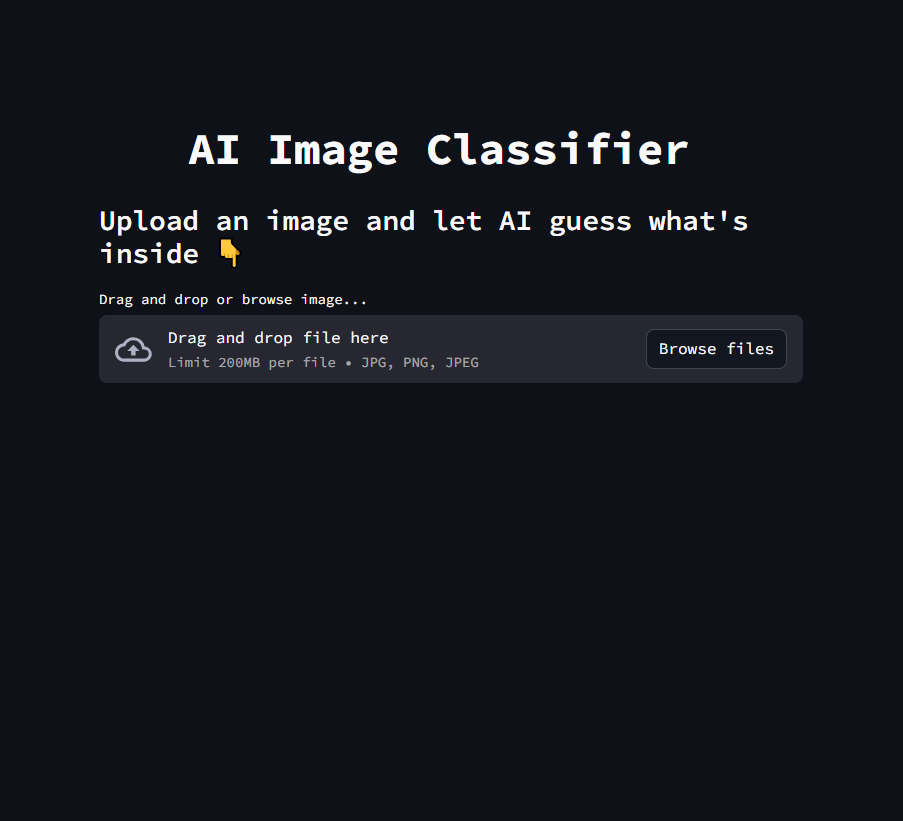
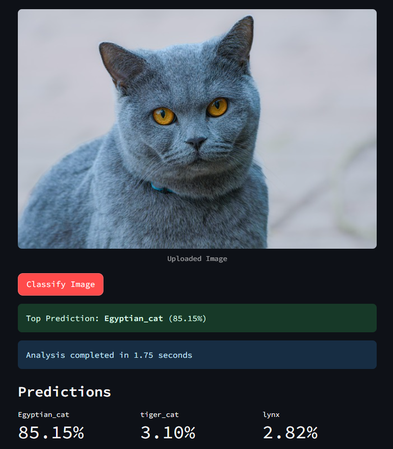

# 🎃 AI Image Classifier

A modern web application that uses deep learning to classify images in real-time. Built with Streamlit and powered by MobileNetV2, this project provides an intuitive interface for image recognition with instant results.

### Main Interface


### Classification Results


## ✨ Features

- **Real-time Image Classification**: Upload images and get instant AI-powered predictions
- **Top-3 Predictions**: View the most likely classifications with confidence scores
- **Interactive UI**: Modern, responsive interface with custom styling
- **Fast Processing**: Optimized with MobileNetV2 for quick inference
- **Visual Feedback**: Balloons animation for high-confidence predictions (>80%)
- **Performance Metrics**: Shows analysis time for each classification

## 🚀 Demo

Upload any image (JPG, PNG) and watch the AI analyze it in seconds! The app will show:
- Top prediction with confidence percentage
- Three most likely classifications
- Processing time
- Celebratory animation for high-confidence results

## 🛠️ Technology Stack

- **Frontend**: Streamlit
- **Deep Learning**: TensorFlow/Keras
- **Model**: MobileNetV2 (pre-trained on ImageNet)
- **Image Processing**: OpenCV, PIL
- **Language**: Python 3.8+

## 📁 Project Structure

```
ai_image_classifier/
│
├── main.py             # Entry point (Streamlit app)
├── app/
│   ├── __init__.py
│   ├── model.py        # Loads MobileNetV2 model
│   ├── preprocess.py   # Image preprocessing logic
│   ├── classify.py     # Classification + decode logic
│   └── style.py        # Custom CSS & UI styling
├── requirements.txt    # Python dependencies
├── README.md          # Project documentation
└── .streamlit/
    └── config.toml    # (Optional) Streamlit theme settings
```

## ⚡ Quick Start

### Prerequisites
- Python 3.8 or higher
- pip or uv package manager

### Installation

1. **Clone the repository**
   ```bash
   git clone https://github.com/yourusername/ai-image-classifier.git
   cd ai-image-classifier
   ```

2. **Create virtual environment** (recommended)
   ```bash
   # Using venv
   python -m venv venv
   source venv/bin/activate  # On Windows: venv\Scripts\activate
   
   # Or using uv (faster)
   uv venv
   source .venv/bin/activate  # On Windows: .venv\Scripts\activate
   ```

3. **Install dependencies**
   ```bash
   # Using pip
   pip install -r requirements.txt
   
   # Or using uv (recommended - much faster)
   uv pip install -r requirements.txt
   ```

4. **Run the application**
   ```bash
   streamlit run main.py
   ```

5. **Open your browser** and navigate to `http://localhost:8501`

## 🎯 How It Works

1. **Image Upload**: Users drag and drop or browse for an image file
2. **Preprocessing**: Image is resized to 224x224 pixels and normalized
3. **Model Inference**: MobileNetV2 processes the image and generates predictions
4. **Results Display**: Top 3 predictions are shown with confidence scores
5. **Visual Feedback**: High-confidence predictions trigger celebration animations

## 🔧 Configuration

### Custom Styling
Modify `app/style.py` to customize the UI appearance:
- Button colors and styles
- Layout and spacing
- Typography and fonts

### Model Settings
The app uses MobileNetV2 by default, but you can modify `app/model.py` to use different pre-trained models:
- ResNet50
- VGG16
- InceptionV3

## 📊 Performance

- **Model Size**: ~14MB (MobileNetV2)
- **Inference Time**: ~0.1-0.5 seconds per image
- **Accuracy**: 71.8% top-1 accuracy on ImageNet
- **Supported Classes**: 1,000 ImageNet categories

## 🤝 Contributing

Contributions are welcome! Please feel free to submit a Pull Request. For major changes, please open an issue first to discuss what you would like to change.

### Development Setup

1. Fork the repository
2. Create a feature branch (`git checkout -b feature/AmazingFeature`)
3. Make your changes
4. Add tests if applicable
5. Commit your changes (`git commit -m 'Add some AmazingFeature'`)
6. Push to the branch (`git push origin feature/AmazingFeature`)
7. Open a Pull Request

## 📝 License

This project is licensed under the MIT License - see the [LICENSE](LICENSE) file for details.

## 🙏 Acknowledgments

- [TensorFlow](https://tensorflow.org/) for the deep learning framework
- [Streamlit](https://streamlit.io/) for the amazing web app framework
- [ImageNet](http://www.image-net.org/) dataset for training the base model
- [MobileNetV2](https://arxiv.org/abs/1801.04381) architecture for efficient inference

---

⭐️ If you found this project helpful, please consider giving it a star!
