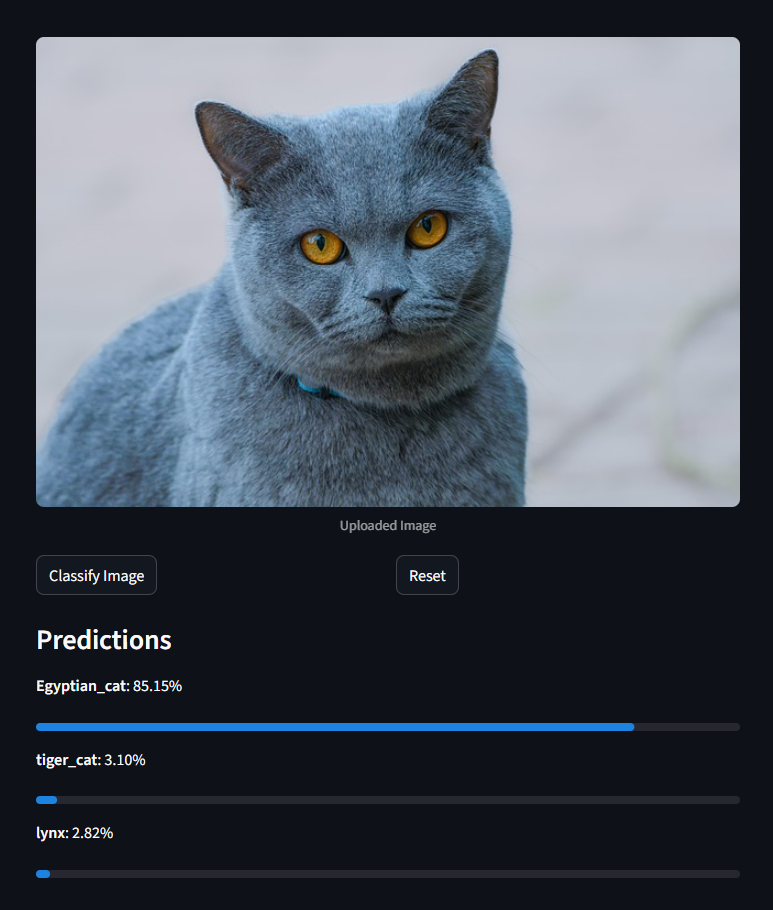

# 🤖 AI Image Classifier


A modern, user-friendly web application that leverages deep learning to classify images with high accuracy. Built with Streamlit and powered by MobileNetV2, this tool can identify objects, animals, and scenes from uploaded images in real-time.

## ✨ Features

- **Real-time Image Classification**: Upload any image and get instant predictions
- **Multiple Predictions**: Shows top 3 most likely classifications with confidence scores
- **Interactive UI**: Clean, responsive interface built with Streamlit
- **Progress Visualization**: Dynamic progress bars for prediction confidence
- **Error Handling**: Robust error management for various image formats
- **Mobile Optimized**: Uses MobileNetV2 for fast, efficient processing

## 🚀 Demo




## 🛠️ Technology Stack

- **Frontend**: Streamlit
- **Deep Learning**: TensorFlow/Keras
- **Model**: MobileNetV2 (pre-trained on ImageNet)
- **Image Processing**: OpenCV, PIL
- **Language**: Python 3.8+

## 📦 Installation

1. **Clone the repository**
   ```bash
   git clone https://github.com/yourusername/ai-image-classifier.git
   cd ai-image-classifier
   ```

2. **Create a virtual environment**
   ```bash
   python -m venv venv
   source venv/bin/activate  # On Windows: venv\Scripts\activate
   ```

3. **Install dependencies**
   ```bash
   pip install -r requirements.txt
   ```

4. **Run the application**
   ```bash
   streamlit run main.py
   ```

5. **Open your browser** and navigate to `http://localhost:8501`

## 🎯 Usage

1. Launch the application using the command above
2. Click "Choose an image..." to upload your image (JPG, PNG supported)
3. Click "Classify Image" to analyze your upload
4. View the top 3 predictions with confidence scores
5. Use "Reset" to start over with a new image

## 🏗️ Project Structure

```
ai-image-classifier/
├── main.py              # Streamlit web application
├── model.py             # Model loading and prediction logic
├── utils.py             # Image preprocessing utilities
├── requirements.txt     # Python dependencies
├── README.md           # Project documentation
└── assets/             # Demo images and resources
```

## 🧠 How It Works

1. **Image Upload**: Users upload images through Streamlit's file uploader
2. **Preprocessing**: Images are resized to 224x224px and normalized using MobileNetV2's preprocessing
3. **Prediction**: The pre-trained MobileNetV2 model analyzes the processed image
4. **Results**: Top 3 predictions are displayed with confidence percentages and progress bars

## 🔧 Technical Details

- **Model**: MobileNetV2 trained on ImageNet dataset (1000+ classes)
- **Input Size**: 224×224 pixels
- **Preprocessing**: Standard ImageNet normalization
- **Performance**: Optimized for speed and accuracy balance
- **Caching**: Model loaded once and cached for multiple predictions

## 📊 Supported Categories

The model can classify 1000+ different categories including:
- Animals (cats, dogs, birds, etc.)
- Vehicles (cars, planes, boats, etc.)
- Objects (furniture, tools, electronics, etc.)
- Food items (fruits, dishes, beverages, etc.)
- Nature (flowers, trees, landscapes, etc.)

## 🤝 Contributing

Contributions are welcome! Here's how you can help:

1. Fork the repository
2. Create a feature branch (`git checkout -b feature/amazing-feature`)
3. Commit your changes (`git commit -m 'Add amazing feature'`)
4. Push to the branch (`git push origin feature/amazing-feature`)
5. Open a Pull Request

## 🚧 Future Enhancements

- [ ] Custom model training interface
- [ ] Batch image processing
- [ ] Image augmentation options
- [ ] Export predictions to CSV
- [ ] Multi-language support
- [ ] Dark mode toggle
- [ ] API endpoint creation

## 📝 License

This project is licensed under the MIT License - see the [LICENSE](LICENSE) file for details.

## 👨‍💻 Author

**Sameer Raza**

- LinkedIn: [Sameer Raza](https://www.linkedin.com/in/sameerraza48/)

## 🙏 Acknowledgments

- TensorFlow team for the excellent MobileNetV2 model
- Streamlit for the amazing web app framework
- ImageNet dataset contributors
- Open source community

---

⭐ **Star this repository if you found it helpful!**
